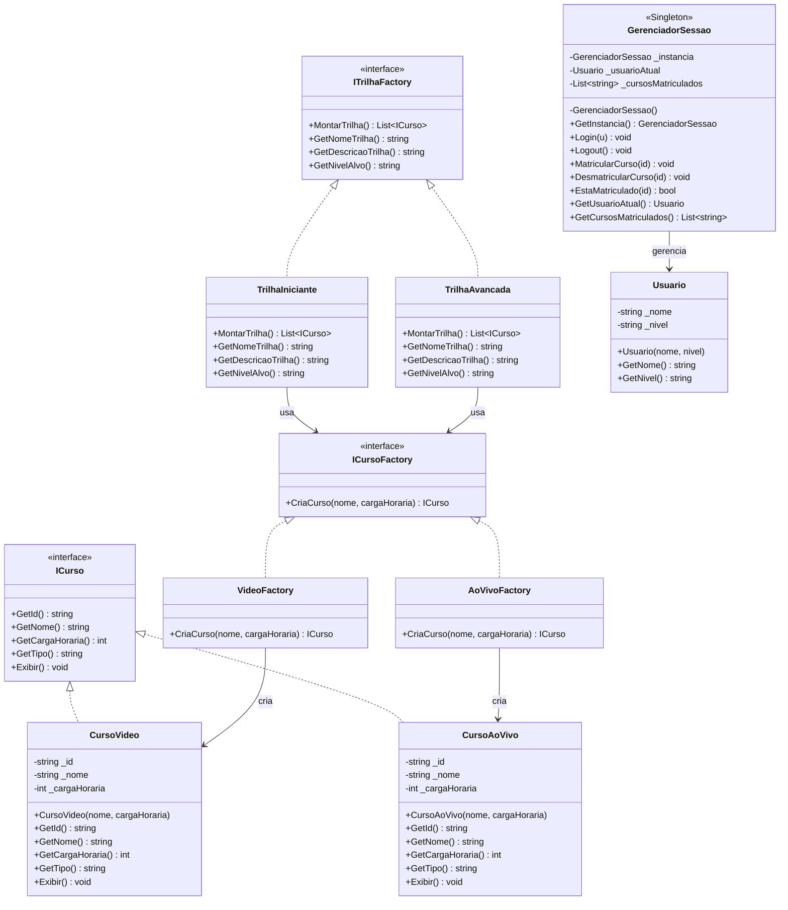

# DevPath — Plataforma de Cursos Online
### ASP.NET Core MVC · C# · Padrões SOLID + Design Patterns

---

## 🚀 Como Executar

```bash
# Pré-requisito: .NET 8 SDK instalado
# https://dotnet.microsoft.com/download

cd PlataformaCursosOnline
dotnet run
# Acesse: https://localhost:5001
```

---

## 📁 Estrutura do Projeto

```
PlataformaCursosOnline/
│
├── Models/                         # Entidades e interfaces de domínio
│   ├── ICurso.cs                   # Interface principal (LSP + ISP)
│   ├── CursoVideo.cs               # Curso em vídeo gravado
│   ├── CursoAoVivo.cs              # Curso ao vivo (live)
│   ├── Usuario.cs                  # Entidade de usuário
│   └── Trilha.cs                   # Trilha de aprendizagem
│
├── Factories/                      # Padrão Factory Method + Abstract Factory
│   ├── ICursoFactory.cs            # Contrato de factory de cursos
│   ├── VideoFactory.cs             # Cria CursoVideo
│   ├── AoVivoFactory.cs            # Cria CursoAoVivo
│   ├── ITrilhaFactory.cs           # Contrato de factory de trilhas
│   ├── TrilhaIniciante.cs          # Monta trilha para iniciantes
│   └── TrilhaAvancada.cs           # Monta trilha para avançados
│
├── Singleton/
│   └── GerenciadorSessao.cs        # Singleton thread-safe (Lazy<T>)
│
├── Services/                       # Camada de negócio (DIP: abstrações)
│   ├── ICursoService.cs
│   ├── CursoService.cs
│   ├── ITrilhaService.cs
│   ├── TrilhaService.cs
│   ├── IUsuarioService.cs
│   └── UsuarioService.cs
│
├── Controllers/                    # Camada C do MVC
│   ├── HomeController.cs
│   ├── CursoController.cs
│   ├── TrilhaController.cs
│   └── UsuarioController.cs
│
├── Views/                          # Camada V do MVC (Razor)
│   ├── Shared/_Layout.cshtml       # Layout base
│   ├── Home/Index.cshtml
│   ├── Curso/{Index,Detalhes,MeusCursos}.cshtml
│   ├── Trilha/{Index,Detalhes}.cshtml
│   └── Usuario/{Login,Perfil}.cshtml
│
├── wwwroot/
│   ├── css/site.css                # Design dark editorial
│   └── js/site.js
│
└── Program.cs                      # DI Container + Pipeline
```

---

## 🏛️ Princípios SOLID

| Princípio | Implementação |
|-----------|--------------|
| **S** — Single Responsibility | `VideoFactory` só cria vídeos. `GerenciadorSessao` só gerencia sessão. |
| **O** — Open/Closed | `TrilhaService` aceita qualquer `ITrilhaFactory` sem ser modificado. |
| **L** — Liskov Substitution | `CursoVideo` e `CursoAoVivo` substituem `ICurso` sem quebras. |
| **I** — Interface Segregation | `ICursoFactory` e `ITrilhaFactory` são contratos focados e menores. |
| **D** — Dependency Inversion | Controllers recebem `ICursoService` (abstração), não `CursoService`. |

---

## 🎨 Design Patterns Aplicados

| Pattern | Onde |
|---------|------|
| **Factory Method** | `VideoFactory`, `AoVivoFactory` → `ICursoFactory` |
| **Abstract Factory** | `TrilhaIniciante`, `TrilhaAvancada` → `ITrilhaFactory` |
| **Singleton** | `GerenciadorSessao` com `Lazy<T>` (thread-safe) |
| **MVC** | Controllers → Services → Views (Razor) |
| **Dependency Injection** | Registrado no `Program.cs` via `builder.Services` |

---

## 🗺️ Diagrama de Classes (Mermaid)



---

## 🔗 Rotas Disponíveis

| Rota | Ação |
|------|------|
| `GET /` | Home com destaques |
| `GET /Curso` | Catálogo (com filtro e busca) |
| `GET /Curso/Detalhes/{id}` | Detalhes do curso |
| `POST /Curso/Matricular` | Matricular-se |
| `POST /Curso/Desmatricular` | Cancelar matrícula |
| `GET /Curso/MeusCursos` | Cursos do usuário |
| `GET /Trilha` | Listar trilhas |
| `GET /Trilha/Detalhes/{nivel}` | Detalhes da trilha |
| `GET /Usuario/Login` | Tela de login |
| `POST /Usuario/Login` | Autenticar |
| `POST /Usuario/Logout` | Encerrar sessão |
| `GET /Usuario/Perfil` | Perfil do usuário |
